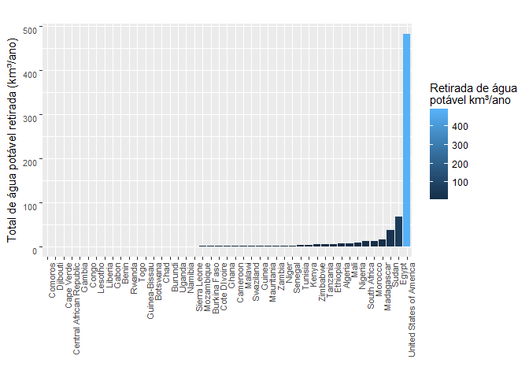
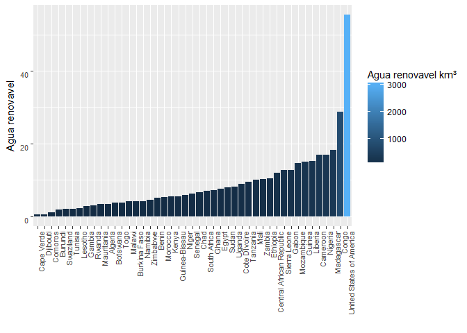
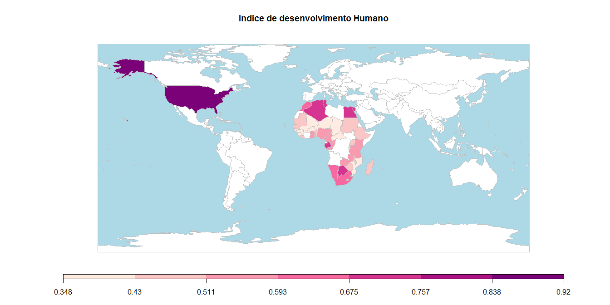
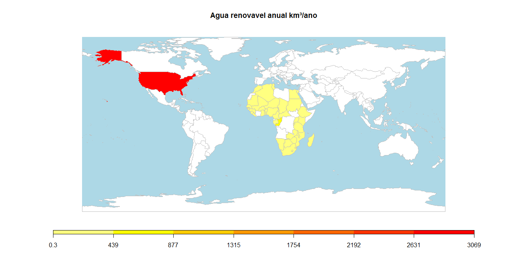
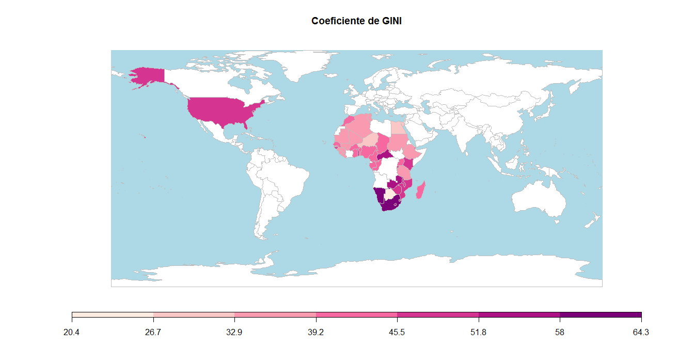
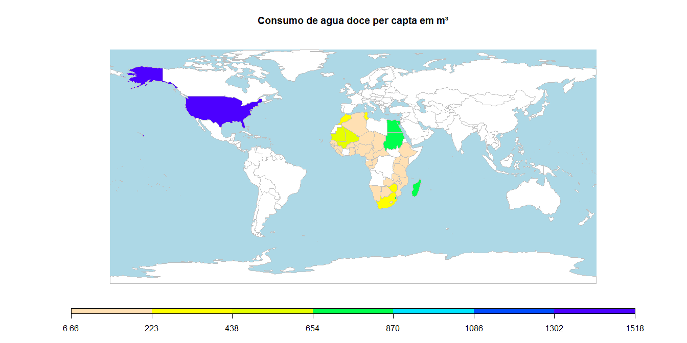
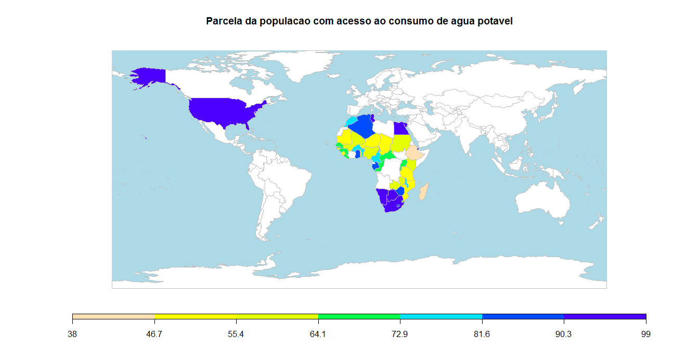

Consumo de Agua e Desigualdade
------------------------------

A breve e presente analise tem por objetivo uma avaliacao do consumo de Agua em paises estadunidenses em comparativo com paises da Africa-subsaariana como fator de influencia em desigualdade.

Correlacao entre as variaveis
-----------------------------


**TOTAL\_FRESHWATER\_WD\_KM3\_2010**

``` r
df_original <- df_original[order(df_original$TOTAL_FRESHWATER_WD_KM3_2010),]

df_original$COUNTRY <- factor(df_original$COUNTRY, levels=df_original$COUNTRY[order(df_original$TOTAL_FRESHWATER_WD_KM3_2010)])

ggplot(df_original, aes(x=COUNTRY,y=TOTAL_FRESHWATER_WD_KM3_2010)) +
  geom_bar(stat="identity", aes(fill=TOTAL_FRESHWATER_WD_KM3_2010)) +
  theme(axis.text.x = element_text(angle = 90, vjust = 1, size = 8, hjust = 1),
        axis.text.y = element_text(angle = 0, vjust = 1, size = 8, hjust = 1)) +
  scale_fill_continuous(name="Retirada de água\npotável km³/ano") +
  xlab("") + ylab("Total de água potável retirada (km³/ano)") + ggtitle("")
```



**POPULATION\_MILLIONS\_2010**

``` r
df_original <- df_original[order(df_original$POPULATION_MILLIONS_2010),]

df_original$COUNTRY <- factor(df_original$COUNTRY, levels=df_original$COUNTRY[order(df_original$POPULATION_MILLIONS_2010)])

ggplot(df_original, aes(x=COUNTRY,y=POPULATION_MILLIONS_2010)) +
  geom_bar(stat="identity", aes(fill=POPULATION_MILLIONS_2010)) +
  theme(axis.text.x = element_text(angle = 90, vjust = 1, size = 8, hjust = 1),
        axis.text.y = element_text(angle = 0, vjust = 1, size = 8, hjust = 1)) +   scale_fill_continuous(name="Populacao\n(milhões)") +
  xlab("") + ylab("Populacao em milhoes")
```


**ANNUAL\_RENEWABLE\_WATER\_2010**

``` r
df_original <- df_original[order(df_original$ANNUAL_RENEWABLE_WATER_2010),]

df_original$COUNTRY <- factor(df_original$COUNTRY, levels=df_original$COUNTRY[order(df_original$ANNUAL_RENEWABLE_WATER_2010)])

ggplot(df_original, aes(x=COUNTRY,y=sqrt(ANNUAL_RENEWABLE_WATER_2010))) +
  geom_bar(stat="identity", aes(fill=ANNUAL_RENEWABLE_WATER_2010)) +
  theme(axis.text.x = element_text(angle = 90, vjust = 1, size = 8, hjust = 1),
        axis.text.y = element_text(angle = 0, vjust = 1, size = 8, hjust = 1)) +
  xlab("") + ylab("Agua renovavel") +
  scale_fill_continuous(name="Agua renovavel km³")
```



Mapas
-----

### IDH

    ## 44 codes from your data successfully matched countries in the map
    ## 1 codes from your data failed to match with a country code in the map
    ## 199 codes from the map weren't represented in your data

    ## Warning in rwmGetColours(colourPalette, numColours): 5 colours specified
    ## and 7 required, using interpolation to calculate colours



### Total de retirada de agua doce km³/ano

    ## 44 codes from your data successfully matched countries in the map
    ## 1 codes from your data failed to match with a country code in the map
    ## 199 codes from the map weren't represented in your data


### Agua renovavel anual

    ## 44 codes from your data successfully matched countries in the map
    ## 1 codes from your data failed to match with a country code in the map
    ## 199 codes from the map weren't represented in your data



### Coeficiente de GINI

    ## 44 codes from your data successfully matched countries in the map
    ## 1 codes from your data failed to match with a country code in the map
    ## 199 codes from the map weren't represented in your data

    ## Warning in rwmGetColours(colourPalette, numColours): 5 colours specified
    ## and 7 required, using interpolation to calculate colours



### Consumo per capta de agua doce

    ## 44 codes from your data successfully matched countries in the map
    ## 1 codes from your data failed to match with a country code in the map
    ## 199 codes from the map weren't represented in your data



### Acesso ao consumo de agua potavel

    ## 44 codes from your data successfully matched countries in the map
    ## 1 codes from your data failed to match with a country code in the map
    ## 199 codes from the map weren't represented in your data


