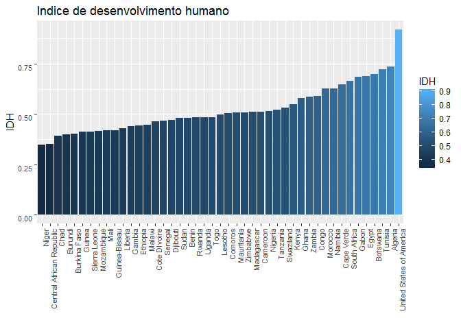

Consumo de Água e Desigualdade
------------------------------

A breve e presente análise tem por objetivo uma avaliação do consumo de água em países estadunidenses em comparativo com países da Africa-subsaariana como fator de influência em desigualdade.

Variáveis presentes no dataset utilizado para análise
-----------------------------------------------------

**country**:
**populattion\_milions**:
**hdi\_2015**:
**gini**:
**access\_to\_isanitation\_2008**:
**access\_to\_idrinking\_water\_2008**: **total\_freshwater\_wd\_2010**:
**per\_capta\_wd\_m3\_2010**:
**annual\_renewable\_water\_2010**:

Correlação entre as variáveis
-----------------------------



Obtem-se da matriz de correlação as correlações fortes
**TOTAL\_FRESHWATER\_WD\_KM3\_2010 X HDI\_2015**

``` r
df_original = subset(df_original, COUNTRY != 'United States of America')
ggplot(df_original, aes(x=HDI_2015,y=TOTAL_FRESHWATER_WD_KM3_2010,type="scatter", mode="markers")) +
  geom_point(aes(color=HDI_2015,size=HDI_2015))
```

    ## Warning: Removed 3 rows containing missing values (geom_point).


**TOTAL\_FRESH\_WATER\_WD\_KM3\_2010 X POPULATTION\_MILLIONS\_2010**

**ANNUAL\_RENEWABLE\_WATER\_2010 X HDI\_2015**

**ANNUAL\_RENEWABLE\_WATER\_2010 X POPULATTION\_MILLIONS\_2010**
